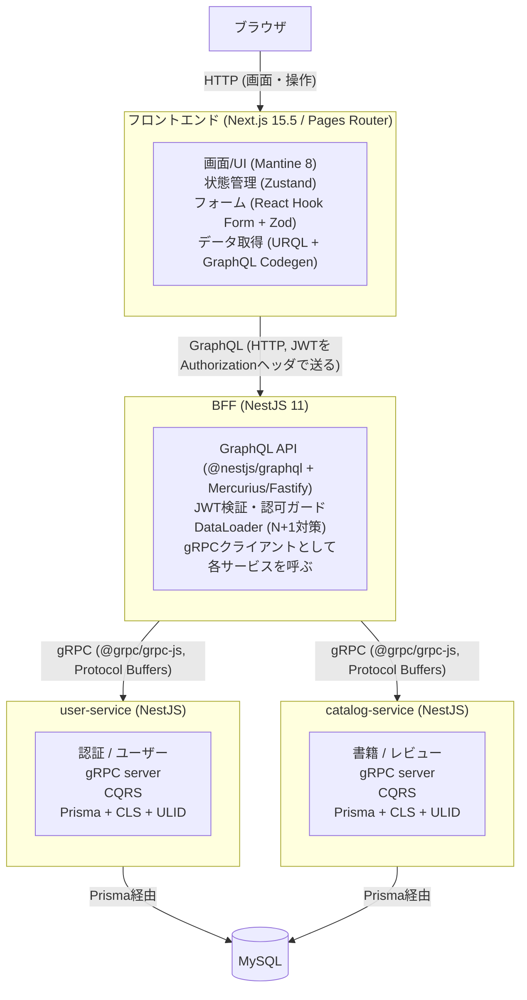

# 開発演習課題 要件定義書 — 書籍レビュー共有アプリ「BookShelf」

---

## 1. このドキュメントの位置づけ

本書は、あなたが1週間で取り組む開発演習課題の**要件定義書**です。
「何を」「なぜ」「どこまで」作るのかを定義します。「いつ・どの順番で作るか」は別冊の [開発計画書](./02_開発計画書.md) を参照してください。

このドキュメントを読み終えたら、まず**自分の言葉で要件を説明できるか**を確認してください。要件を理解せずに実装を始めるのは、実務で最も多い失敗のひとつです。

---

## 2. 課題の目的（なぜこの課題に取り組むのか）

本課題のゴールは、そこから一歩進んで **「実務で使われる分散アーキテクチャ」** を、小さく作りながら体験することです。

具体的には、次の「実務レベルの設計判断」を、自分の手を動かして理解することを狙います。

| 学ぶテーマ | ToDoアプリとの違い | なぜ実務で重要か |
| --- | --- | --- |
| **BFF（Backend For Frontend）** | フロントが直接DBやRESTを叩かない | 画面都合とドメイン都合を分離し、フロントの変更がバックに波及しにくくする |
| **マイクロサービス + gRPC** | 単一サーバではなくサービス分割 | サービス単位でのスケール・デプロイ・責務分離 |
| **CQRS（commands / queries 分離）** | 更新系と参照系を分けて設計 | 読み取りと書き込みで最適化方針が異なることを理解する |
| **GraphQL** | RESTの複数エンドポイントではない | 画面が必要なデータを過不足なく取得する |
| **N+1問題とDataLoader** | ToDoでは顕在化しにくい | リレーションを持つデータを扱う際の必須知識 |

> **重要な心構え**
> この課題は「全部を完璧に作る」ことがゴールではありません。
> **アーキテクチャの各層が「なぜ存在するのか」を説明できるようになること** がゴールです。
> 機能を1つ減らしてでも、「なぜこの設計なのか」を言語化することを優先してください。

---

## 3. 作るもの（アプリケーション概要）

### 3.1 BookShelf とは

ユーザーが**書籍を登録**し、その書籍に**レビュー（評価＋コメント）を投稿・共有**できるWebアプリケーションです。

### 3.2 想定ユーザーと主なユースケース

- 一般ユーザーは、アカウントを登録してログインする
- 読んだ本を書籍として登録する
- 任意の書籍にレビュー（5段階評価＋コメント）を投稿する
- 他のユーザーが投稿したレビューを閲覧する
- 自分が投稿したレビューを編集・削除する

### 3.3 スコープ外（今回は作らない）

意図的に作らないものを明示します。**「やらないことを決める」のも設計判断**です。

- 画像アップロード（書籍表紙など）
- いいね / フォロー / 通知などのSNS機能
- 書籍情報の外部API連携（Google Books等）
- 管理者画面・ロール管理（一般ユーザーのみ）
- パスワードリセット、メール送信
- リアルタイム更新（WebSocket / Subscription）

---

## 4. 機能要件（ユーザーストーリーと受け入れ条件）

各機能は「ユーザーストーリー」と「受け入れ条件（Acceptance Criteria）」で定義します。
**受け入れ条件を満たして初めてその機能は「完成」** とみなします（テストの根拠になります）。

### F-1. アカウント登録（サインアップ）
> ユーザーとして、メールアドレスとパスワードでアカウントを登録したい。サービスを利用するため。

- [ ] メールアドレス・パスワード・表示名を入力して登録できる
- [ ] メールアドレスは形式バリデーションされ、重複登録はエラーになる
- [ ] パスワードは平文で保存されない（ハッシュ化する）
- [ ] 登録成功後、ログイン状態になる（またはログイン画面へ遷移する）

### F-2. ログイン / ログアウト
> ユーザーとして、登録した資格情報でログインしたい。自分のレビューを管理するため。

- [ ] 正しいメール・パスワードでログインでき、JWTが発行される
- [ ] 誤った資格情報では認証エラーになる（どちらが間違いかは明示しない）
- [ ] ログアウトでき、保護されたページにアクセスできなくなる

### F-3. 書籍の登録
> ログインユーザーとして、本を書籍として登録したい。レビューを書く対象を作るため。

- [ ] タイトル・著者・ISBN（任意）・概要（任意）を入力して登録できる
- [ ] 未認証ユーザーは登録できない（認可エラー）
- [ ] 入力値はフロント・サーバ双方でバリデーションされる

### F-4. 書籍一覧の閲覧（検索・ページネーション）
> ユーザーとして、登録された書籍を一覧で見たい。レビューしたい本を探すため。

- [ ] 書籍一覧を表示でき、各書籍に「平均評価」と「レビュー件数」が表示される
- [ ] タイトル・著者でキーワード検索ができる
- [ ] ページネーション（または無限スクロール）で大量データに対応できる
- [ ] 未認証でも閲覧できる（公開情報）

### F-5. 書籍詳細とレビュー閲覧
> ユーザーとして、書籍の詳細とそれに紐づくレビュー一覧を見たい。

- [ ] 書籍の基本情報と、紐づく全レビュー（投稿者の表示名・評価・コメント・投稿日時）が表示される
- [ ] レビューは新しい順に表示される
- [ ] **N+1問題が発生しないように実装されている**（後述）

### F-6. レビューの投稿
> ログインユーザーとして、書籍にレビューを投稿したい。

- [ ] 5段階評価（1〜5）とコメントを投稿できる
- [ ] 同一ユーザーが同一書籍に投稿できるのは1件まで（重複はエラー or 更新扱い。どちらにするか設計判断し、ドキュメント化すること）
- [ ] 未認証ユーザーは投稿できない

### F-7. レビューの編集・削除（認可）
> ログインユーザーとして、自分のレビューだけを編集・削除したい。

- [ ] 自分が投稿したレビューのみ編集・削除できる
- [ ] **他人のレビューは編集・削除できない（サーバ側で認可チェックする）**
- [ ] UI上でも他人のレビューには編集・削除ボタンを出さない

### F-8. マイページ
> ログインユーザーとして、自分が投稿したレビュー一覧を見たい。

- [ ] 自分のレビューを一覧表示できる（対象書籍へのリンク付き）

> **最重要の学習ポイント（F-5, F-7）**
> - F-5 は **N+1問題とDataLoader** を学ぶための機能です。
> - F-7 は **認証（誰か）と認可（何をしてよいか）の違い** を学ぶための機能です。
> この2つは必ず実装し、メンターレビューで重点的に説明してください。

---

## 5. 非機能要件

| 区分 | 要件 |
| --- | --- |
| バリデーション | 入力はフロント（Zod）とサーバ（class-validator / Zod）の**両方**で検証する。「クライアントを信用しない」原則 |
| エラーハンドリング | ユーザーに分かるエラー表示と、サーバ側の適切なステータス／GraphQLエラーを返す |
| 型安全 | `any` を安易に使わない。GraphQLは Codegen で型生成し、手書き型と二重管理しない |
| セキュリティ | パスワードはハッシュ化（bcrypt等）。JWTの秘密鍵は環境変数管理。認可はサーバ側で必ず実施 |
| 識別子 | 主キーは連番ではなく **ULID** を用いる（理由を説明できること） |
| テスト | ドメインロジック（commands側）のユニットテスト、主要画面のStorybook、ハッピーパスのE2Eを最低1本 |
| コード品質 | ESLint / Prettier / TypeScript の型チェックがCIまたはローカルで通ること |

---

## 6. システム構成（アーキテクチャ）

### 6.1 全体像



> **サービス分割の指針**
> マイクロサービスは「2つ」に分割します（`user-service` と `catalog-service`）。
> 初級者が3つ以上に分けると配線（proto・接続・起動）だけで時間を消費します。
> **「なぜここで線を引いたか（ユーザー境界 / 書籍・レビュー境界）」を説明できること** が目的です。

### 6.2 各層の責務（役割分担を必ず理解すること）

- **フロントエンド**: 画面表示とユーザー操作。ビジネスルールを持たない。
- **BFF**: 「画面が欲しい形」にデータを整形・集約する層。認証検証・認可・DataLoaderはここ。**ドメインの真実（ビジネスルール）は持たない**。
- **バックエンド（マイクロサービス）**: ドメインロジックとデータ永続化の本体。CQRSで commands / queries を分離。

> よくある誤解: 「BFFにビジネスロジックを書く」。BFFは集約・整形に徹し、ルールはバックエンドに置きます。境界が曖昧になったらメンターに相談してください。

### 6.3 CQRS（commands / queries）の方針

各バックエンドサービス内で、ディレクトリレベルで読み書きを分離します。

```
src/
  commands/    # 状態を変更する操作（登録・更新・削除）
    register-book/
    post-review/
    update-review/
    delete-review/
  queries/     # 状態を変更しない参照操作
    list-books/
    get-book-detail/
    list-my-reviews/
```

- **commands**: 入力を検証し、ドメインルールを適用し、DBを更新する。戻り値は最小限（IDなど）。
- **queries**: 読み取り専用。表示に最適な形でデータを返す。ビジネスルールの判断はしない。
- 今回はDBは1つ（commands/queriesで同じMySQLを参照）でよい。**「読み書きでモデルを分けて考える」という思考法を身につける** のが目的で、イベントソーシングやDB分離までは求めません。

---

## 7. データモデル

```
User
  id           ULID (PK)
  email        string (unique)
  passwordHash string
  displayName  string
  createdAt    datetime

Book
  id            ULID (PK)
  title         string
  author        string
  isbn          string?  (nullable)
  description   string?  (nullable)
  createdByUserId  ULID (FK -> User.id)
  createdAt     datetime

Review
  id        ULID (PK)
  bookId    ULID (FK -> Book.id)
  userId    ULID (FK -> User.id)
  rating    int (1..5)
  comment   string
  createdAt datetime
  updatedAt datetime
  -- (bookId, userId) はユニーク（1ユーザー1書籍1レビュー）
```

- リレーション: `Book 1 - N Review`、`User 1 - N Review`、`User 1 - N Book`
- `Review` から投稿者の `displayName` を表示する箇所が **N+1の発生源** です（F-5）。

---

## 8. API仕様（スケッチ）

> 完全な定義はあなたが設計します。以下は出発点です。

### 8.1 GraphQL スキーマ（BFFが公開、抜粋）

```graphql
type User { id: ID!  displayName: String! }

type Book {
  id: ID!
  title: String!
  author: String!
  isbn: String
  description: String
  averageRating: Float!     # 集計値
  reviewCount: Int!         # 集計値
  reviews: [Review!]!       # 詳細画面で展開（N+1注意）
}

type Review {
  id: ID!
  rating: Int!
  comment: String!
  author: User!             # ← ここがDataLoaderの対象
  createdAt: String!
}

type Query {
  books(keyword: String, page: Int, perPage: Int): BookConnection!
  book(id: ID!): Book
  myReviews: [Review!]!     # 要認証
}

type Mutation {
  signUp(input: SignUpInput!): AuthPayload!
  login(input: LoginInput!): AuthPayload!
  registerBook(input: RegisterBookInput!): Book!     # 要認証
  postReview(input: PostReviewInput!): Review!        # 要認証
  updateReview(input: UpdateReviewInput!): Review!    # 要認証・要認可
  deleteReview(id: ID!): Boolean!                     # 要認証・要認可
}
```

### 8.2 gRPC（protoスケッチ、抜粋）

```proto
service CatalogService {
  rpc RegisterBook(RegisterBookRequest) returns (BookReply);
  rpc ListBooks(ListBooksRequest) returns (ListBooksReply);
  rpc GetBook(GetBookRequest) returns (BookReply);
  rpc PostReview(PostReviewRequest) returns (ReviewReply);
  rpc ListReviewsByBookIds(ListReviewsByBookIdsRequest) returns (ListReviewsReply); // バッチ取得
}

service UserService {
  rpc SignUp(SignUpRequest) returns (AuthReply);
  rpc Login(LoginRequest) returns (AuthReply);
  rpc GetUsersByIds(GetUsersByIdsRequest) returns (UsersReply); // ← DataLoaderから呼ぶバッチAPI
}
```

> **設計のヒント**: `GetUsersByIds`（複数IDを一度に受ける）を用意しておくと、BFFのDataLoaderが「IDをまとめて1回のgRPC呼び出しで解決」でき、N+1を防げます。

---

## 9. リポジトリ構成（モノレポ / pnpm ワークスペース）

本課題は**モノレポ**（1リポジトリに複数アプリ・共有パッケージを集約）で構成します。
パッケージマネージャは **pnpm** を使用し、`pnpm-workspace.yaml` でワークスペースを定義します。

> **なぜモノレポ + pnpm か**
> - フロント／BFF／各サービスが `.proto` やGraphQLスキーマ・型を**共有**するため、単一リポジトリで管理するとバージョンずれが起きにくい。
> - pnpm はシンボリックリンクによる依存解決で**ディスク効率がよく**、ワークスペース横断のスクリプト実行（`pnpm -r`, `pnpm --filter`）に強い。
> - 学習者は npm/yarn 経験があっても pnpm 未経験のことが多いので、第10章の対応コマンドを参照すること。

```
bookshelf/                  # モノレポのルート
  apps/
    web/                    # Next.js (Pages Router) フロントエンド
    bff/                    # NestJS GraphQL BFF
    user-service/           # NestJS gRPC マイクロサービス
    catalog-service/        # NestJS gRPC マイクロサービス
  packages/
    proto/                  # .proto 定義（サービス間で共有）
    graphql-schema/         # 生成スキーマ / codegen 出力（任意）
    config/                 # 共有設定（ESLint / tsconfig 等、任意）
  pnpm-workspace.yaml       # ワークスペース定義（apps/* と packages/* を登録）
  package.json              # ルート。共通スクリプト・devDependencies を集約
  pnpm-lock.yaml            # ロックファイル（コミット対象）
  tsconfig.base.json        # 共有 TypeScript 設定（任意）
  .npmrc                    # pnpm の挙動設定（任意）
  README.md                 # 起動手順・前提
```

`pnpm-workspace.yaml` の例:

```yaml
packages:
  - "apps/*"
  - "packages/*"
```

主な pnpm コマンド（ワークスペース運用）:

| 目的 | コマンド例 |
| --- | --- |
| 全パッケージの依存をインストール | `pnpm install`（ルートで1回） |
| 特定アプリにのみ依存を追加 | `pnpm --filter web add zustand` |
| 特定アプリのスクリプト実行 | `pnpm --filter bff dev` |
| 全パッケージで同名スクリプトを実行 | `pnpm -r build` / `pnpm -r test` |
| ワークスペース内パッケージを依存に指定 | `package.json` で `"@bookshelf/proto": "workspace:*"` |

> 雛形（pnpm ワークスペース設定、各appの起動・接続・Prisma初期設定）はメンターから提供されます。あなたは**機能の中身**に集中してください。

---

## 10. 技術スタックと「どこで使うか」

| 技術 | 使う場所 | 学ぶこと |
| --- | --- | --- |
| Next.js 15.5 (Pages Router) | web | ページ単位のルーティング、データ取得 |
| Mantine 8（主） / Chakra UI 2（代替） | web | UIコンポーネントの活用。**どちらか一方**を選ぶ |
| Zustand | web | 認証状態などのクライアント状態管理 |
| React Hook Form + Zod | web | フォームと型安全なバリデーション |
| URQL + GraphQL Codegen | web | GraphQLクライアントと型自動生成 |
| NestJS 11 | bff / services | モジュール設計、DI、ガード |
| @nestjs/graphql + Mercurius + Fastify | bff | GraphQLサーバ実装 |
| @grpc/grpc-js | bff / services | サービス間通信 |
| DataLoader | bff | **N+1対策** |
| @nestjs/jwt | bff（検証）/ user-service（発行） | 認証 |
| class-validator / class-transformer | bff / services | DTOバリデーション |
| Prisma 5.17 + MySQL | services | スキーマ・マイグレーション・ORM |
| nestjs-cls | services | リクエストスコープのコンテキスト伝播（実行ユーザー等） |
| ULID | services | ソート可能な一意ID |
| Jest | services中心 | ユニットテスト |
| Storybook 8.6 | web | UIコンポーネントカタログ |
| Playwright | web | E2Eテスト |
| MSW | web | APIモック |

> UIライブラリは **Mantine 8 を主**とします。Chakra UI 2 を選んでも構いませんが、混在させないこと。選んだ理由を一言ドキュメントに残してください。

---

## 11. 開発ワークフロー

- バージョン管理: Git / GitHub
- ブランチ戦略: **GitHubフロー**（`main` から feature ブランチを切り、PRでマージ）
- 1機能 = 1 PR を原則とする（レビューしやすい単位に保つ）
- コミットメッセージは「何を・なぜ」が分かるように書く
- 詳細は [開発計画書](./02_開発計画書.md) を参照

---

## 12. 成果物（提出物）

1. 動作するアプリケーション一式（モノレポ。`README` に起動手順を記載）
2. 簡単な設計メモ（`docs/design.md`）。少なくとも次を説明すること:
   - サービスをどこで分割したか、その理由
   - N+1をどう特定し、どう対処したか
   - 認証と認可をどこで・どう実装したか
   - CQRSで commands / queries をどう分けたか
   - 設計判断で迷った点と、最終的にどう決めたか
3. テスト（ユニット / Storybook / E2E 各最低限）
4. 1週間の振り返りメモ（うまくいった点・詰まった点・次に学びたいこと）

---

## 13. 完成の定義（Definition of Done）

機能単位で、次をすべて満たしたら「完成」とします。

- [ ] 受け入れ条件（第4章）をすべて満たす
- [ ] フロント・サーバ双方でバリデーションされている
- [ ] 型チェック・Lintが通る
- [ ] 該当する最低限のテストがある（commandsのユニット等）
- [ ] PRを出し、メンターレビューを受けてマージした

---

## 14. 評価の観点（あなたが意識すべきこと）

メンターは「完成度」だけでなく、次を重視して見ます（詳細はメンター資料参照）。

1. **アーキテクチャの理解**: 各層の責務を説明できるか
2. **N+1と認可**: 最重要ポイントを正しく実装・説明できるか
3. **型安全とバリデーション**: 「クライアントを信用しない」を実践できているか
4. **設計判断の言語化**: 迷った点を自分の言葉で説明できるか
5. **やりきる力より、考え抜く力**: 全機能未完でも、作った部分の理解が深ければ高く評価される

> 困ったら早めに相談してください。「1人で抱えて1週間を溶かす」のが最悪です。質問することも評価対象です。
